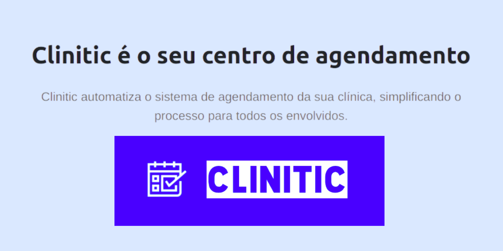
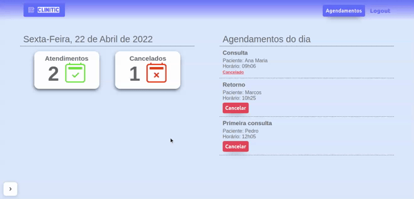

# Clinitic 🩺

<h1 align="center">
    
</h1>

## Índice

- **[Sobre o Projeto](#-sobre-o-projeto)**
- **[Demonstração](#-demonstração)**
- **[Funcionalidades](#-funcionalidades)**
- **[Tecnologias](#-tecnologias)**
- **[Autor](#-autor)**

## 💻 Sobre o projeto

**Clinitic** é uma aplicação de saúde digital de agendamentos para profissionais da saúde.

Com a função de agendamento, o profissional terá sempre uma visão geral de sua agenda e saberá quanto tempo precisa para estar com um paciente.

Com a Clinitic, é mais fácil administrar os atendimentos mensais e semanais, tornando a gestão de tempo mais clara, organizada e profissional.

## 🚀 Demonstração

<h1 align="center">
    
</h1>

**Deploy da aplicação**: 

## 💡 Funcionalidades

- [x] Tela inicial com apresentação da aplicação
  - [x] Cadastro de usuário (profissional da saúde)
- [x] Tela de login
- [x] Tela dashboard
  - [x] Indicador de total de atendimentos para o dia
  - [x] Indicador de atendimentos cancelados para o dia
  - [x] Lista de pacientes agendados para o dia
  - [ ] Lista de pacientes agendados por médico para o dia
- [x] Tela de agendamento
  - [x] Exibição dos agendamentos existentes com nome, sexo, e idade do paciente
  - [x] Exibição dos agendamentos pro semana ou por mês
  - [x] Criação de agendamento com base em um paciente existente ou um novo

## 🛠️ Tecnologias

Para o desenvolvimento desse projeto, as seguintes ferramentas foram utilizadas:

#### Front-end

- **[React](https://pt-br.reactjs.org/)**
- **[FullCalendar](https://fullcalendar.io/)**
- **[React Hook Form](https://react-hook-form.com/)**
- **[React Router Dom](https://www.npmjs.com/package/react-router-dom)**
- **[Axios](https://axios-http.com/ptbr/)**
- **[Yup](https://www.npmjs.com/package/yup)**
- **[React Hot Toast](https://react-hot-toast.com/)**
- **[React Icons](https://react-icons.github.io/react-icons/)**
- **[Styled Components](https://styled-components.com/)**

#### Back-end

- **[Clinitic API](https://github.com/kenmarcos/clinitic-api)**

## 👨‍💻 Autor

Marcos Kenji Kuribayashi

 

---

Desenvolvido por Marcos Kenji Kuribayashi 😉
